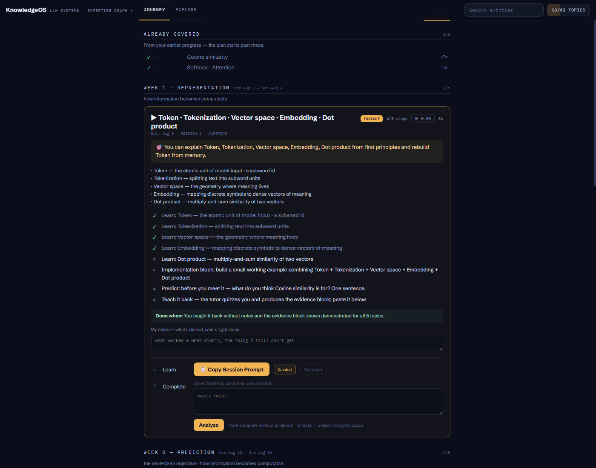
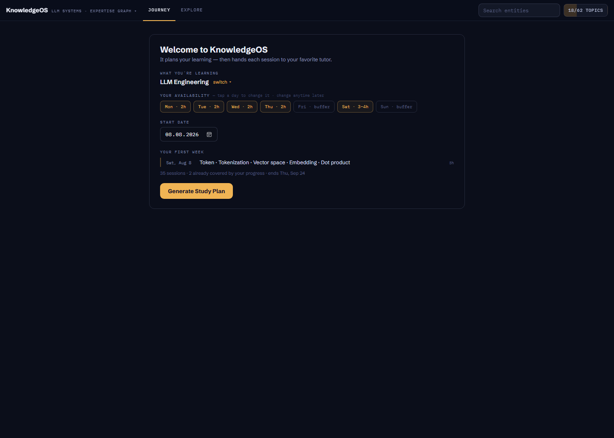
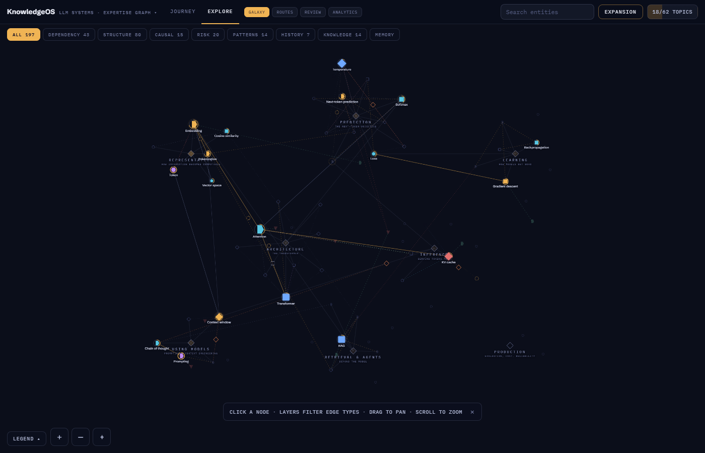

# KnowledgeOS — it generates your study plan, then hands each session to your favorite tutor

  -8A92B8)

KnowledgeOS does not replace Claude/GPT/Gemini. It is **everything around the tutor**: it compiles a knowledge graph into a dated study plan — real evenings, buffers, weekend blocks, exam nights — teaches through your external LLM one session at a time, learns from each pasted conversation, and replans when life happens. Copy/paste is a feature — no provider APIs, no embedded chat, no in-app model calls ever.



**The loop:** `Knowledge Graph → Curriculum Artifact (conceptual order) → Session Planner → Plan Artifact (dated sessions) → 📋 Copy Session Prompt (persona + behavior contract + tonight's arc + your notes) → your LLM (the session) → paste back → Conversation Analyzer → mastery · misconceptions · Learning Profile → the plan advances`.

## Try it

**Live demo:** [ademord.github.io/knowledge-os/KnowledgeOS.dc.html](https://ademord.github.io/knowledge-os/KnowledgeOS.dc.html) — your plan and progress stay in your browser.

## Quickstart

```bash
git clone https://github.com/Ademord/knowledge-os && cd knowledge-os
python -m http.server 4179
```

Open `http://localhost:4179/KnowledgeOS.dc.html` — pick a domain pack (LLM engineering or German A2), set your week, watch the live preview, generate. Everything persists in your browser (localStorage); export/import lives under Explore → Analytics. Any static file server works. Dev niceties: `?graph=<id>` deep-links a pack, `?view=galaxy` opens the graph, `?autoplan=1` generates a default plan on first load (used for screenshots/tests).

## The Journey (default surface — your study plan)

First open: choose what you're learning → set availability (default: Mon–Thu 2h evenings, Friday buffer, Saturday 3–4h block) → watch the **live Week-1 preview** update as you toggle days → Generate. From then on the app opens at *"You are here: Thu, Aug 6 · Session 9 — tonight's session"* with an honest behind/ahead-of-schedule line (identity-based: skipping ahead doesn't hide debt) and one-tap **replan from here** that reflows only the pending dates.



**A session is a learning event, not a concept.** Each dated card carries: a 🎯 payoff ("You can say X and back it with Y"), Learn bullets, an activity arc of checkable steps — *Review* warm-up · *Learn* the new topics · *Predict* the next one · *Implement* (mini-implementation or production drill) · *Teach-back* — a **Done when** criterion, a notes box ("what I measured / where I got stuck") that feeds straight into the next prompt so the tutor resumes instead of restarting, an exclusive session stopwatch (persisted), and the `○ Learn → 📋 Copy Session Prompt · ○ Complete → paste → Analyze → Apply` loop inline. Weeks are real calendar weeks with narratives; hub boundaries end in **exam nights** (examiner persona, optionally grounded in your own project repo via the pack's `projectContext`); the last plain weekday each week is a **review night** whose content resolves from the spaced-repetition scheduler at open time. Keyboard: `j/k` move · `x` check · `o` close · `t` timer (`Shift+t` reset) · `p` print. A plain-text progress report (sessions, schedule delta, time-on-task, notes) is one tap away.

- **Session prompts** (`buildSession`): per-session persona (varies by session and domain — tutor voices for teach nights, a recall coach for review, an examiner for exams) + the **Tutor Session State Machine** (States 0–7: the tutor orients like a professor before any question, then probes, constructs, formalizes, compresses, transfers, and closes with quiz → Done-when → evidence) + tonight's arc + per-topic teaching material + your notes and step position + the observed **Learning Profile** (injected after ≥3 sessions). Zero engine jargon.
- **Going back in time**: click any ✓ session row to open it — its card offers `↺ reopen this session` (just un-completes it) and `↺ reopen & forget its topics` (also resets those topics' mastery to *discovered* and makes them due, so future prompts teach them again instead of saying "I know this"). Open sessions have the same rollback as `↺ reset — unlearn tonight's topics`. Reopened sessions count as behind schedule — replan if needed.
- **Collapse**: click the expanded card's title (or press `o`) to close every card and scan the plan as plain rows; `o` again (or clicking any row) reopens.
- **Learn/Review marks are the "do I know this" switch — bidirectional and live**: check one → that topic is *learned* (mastery up; the next copied prompt says you know it); uncheck it → *back to re-learn* (mastery reset; the next prompt teaches it fresh). Copy Session Prompt always generates from the checklist as it looks right now. The Produce/Predict/Teach-back marks are just tonight's progress ticks and never claim knowledge.
- **Two prompt styles, one switch** (chips beside Copy Session Prompt; one global setting, persisted): **Guided** (default — the state-machine session above) and **Zoltraak** (the Curriculum-Designer research protocol over tonight's cluster: manifesto, graph evidence, learner state, teaching order, plus a `== TONIGHT ==` focus block and the quiet evidence request). Every generated prompt — both styles and all ⚙ handoff flavors — now ends with a begin-immediately line, so agents produce the deliverable instead of asking "what do you want me to do with this?".
- **Conversation Analyzer** (deterministic, no in-app AI): paste the conversation; if it contains the `=== KNOWLEDGEOS EVIDENCE ===` block it is parsed directly; otherwise 📋 Copy Analyzer Prompt extracts it via your LLM. Verdicts apply as pure code — demonstrated → mastery up + scheduled review; partial → small bump, due tomorrow; failed → weak, due now; corrected → bump + misconception resolved — always previewed before Apply. Unknown ids are dropped visibly.
- **Learning Profile** (tiny by design): observed how-you-learn lines with counts; Low/Medium/High confidence by session count; read-only; changes lesson rendering, never the curriculum.

**Explore** holds everything else: the full knowledge galaxy, layers, inspector, routes, review coloring, rediscovery/compression, Analytics, and ⚙ Curriculum admin (the Designer + accept/edit — the only place engine vocabulary appears).



---

A single-file knowledge-graph learning engine ([KnowledgeOS.dc.html](KnowledgeOS.dc.html) + [support.js](support.js) runtime) with **domain packs**: the same core ontology powers a German-A2 lexical graph and an LLM-engineering dependency graph, switchable in the toolbar (or via `?graph=<id>`).

Run: serve this folder statically (launch config `knowledge-os`, port 4179) and open `KnowledgeOS.dc.html`. Lint domain packs with `node validate.js` (edge integrity, practice-data checks, `requires`-cycle detection — exit 1 on errors).

## Modes — one graph, intent-driven projections

The graph is the knowledge engine; the UI adapts to intent. Top tabs: **EXPLORE · LEARN · REVIEW · ANALYTICS**. Fresh sessions get an intent opener ("What are you trying to do today?") that routes into a mode; "don't ask again" persists.

- **Explore** — the free-roam galaxy (unchanged behavior).
- **Learn** — guided **routes** generated from the graph (never a separate page: the camera stays in the galaxy). The routes panel lists authored paths first, then one route per cluster in `ord` order, each with progress ("3/8 · CONTINUE →"). Entering a route draws a gold chain through the steps, recedes everything else, and drives a bottom HUD (step i/N, current topic, REVEAL → PRACTICE → auto-advance, SKIP, INSPECT, exit). Step order: authored `paths` → in-cluster topological sort over `requires`/`builds_on` (dependency domains) → frequency×reinforcement (language domains, frozen per session). Unmet prerequisites are named in the HUD ("needs Positional encoding first").
- **Review** — the same graph recolored by **urgency** (overdue/weak red, due-24h orange, fresh teal; legend follows). The pill becomes "START SESSION" → an ephemeral route over the due queue, weakest first.
- **Analytics** — unchanged stats page.

## Adaptive inspector (node card)

Three depths, composed per node kind, opaque calm panel: **Level 1** (always): headword, meaning, biggest-confusion strip, one example, primary CTA, retrieval bar. **Level 2**: collapsible folds only where content exists (WHY, CONJUGATION, NATIVE, CORPUS, INSIGHTS, GRAMMAR, CULTURE, QUESTIONS, MEMORY — the scheduler's dates). **Level 3**: relationship exploration happens *in the graph* — CONNECTIONS chips (SIMILAR 3 · MORPHOLOGY 5 …) highlight and frame those neighbors on canvas instead of rendering row lists. Cluster cards get **Start route**, Reveal top N, and a **GENERATE** row.

## The Zoltraak curriculum engine (Phase 2 — frozen spec in [docs/PHASE2-curriculum-engine.md](docs/PHASE2-curriculum-engine.md))

The flagship GENERATE flavor. **ZOLTRAAK** (per cluster, or ⚡ whole-domain from the Learn panel) emits the full training protocol — researcher-mode reasoning preamble, MDL objective with Goodhart guard, compression-primitive definition, the five-test rubric (explanatory, not eliminatory), evidence layers ("The graph provides evidence. The heuristic proposes candidates. The rubric structures the argument. Conceptual reasoning makes the final decision."), and the adversarial review loop (alternative decomposition → falsification → Adversarial Defense → compression audit → Rediscovery Test) — followed by the **proposed Zoltraaks with per-rubric graph evidence**, a "why these and not the others" paragraph, specialized spells (with "frequently mistaken for a Zoltraak" flags derived from `optimizes`/`implemented_by` edges), learner state, and teaching order. Selection = normalized structural score (generativity dampens transitive depth), "smallest set" threshold, no numeric weights in the prompt. The modal opens as a **progressive summary** (per-Zoltraak Graph-evidence and Conceptual-reasoning expanders, heuristic-margin bar, full-prompt toggle; Copy always copies everything).

## Experience layer (Phase 3)

- **Alive graph**: selecting a topic draws the gold prerequisite spine upstream AND the teal unlock closure downstream. **Mastery rings** on every explored node (arc = retrieval %, full ring = mastered) make the graph your learning history.
- **Conceptual Compression** — the product's central metric: `MASTER 14 → UNLOCK 30 · 2.1×` (Learn header, Zoltraak modal, Analytics tile; dependency domains only).
- **Rediscovery Test** (◉ in the Learn panel): the graph rewinds to the proposed basis, then reconstructs the field in dependency waves.
- **Discovery beat**: a short basis-derivation animation on the *first* Zoltraak open per scope (re-plays only when the basis changes); **⟲ collapse animation** shows a Zoltraak's specialized spells folding into it; a knowledge-entropy journey strip tracks compression over time. All animations respect `prefers-reduced-motion`.

## Cluster generators — curriculum generation vs. curriculum delivery

> **The stored Curriculum Artifact is the API — not the graph.**
> The Curriculum Artifact is the single source of truth for conceptual organization. All downstream components are pure consumers of that artifact.

Compiler-style pipeline: `Knowledge Graph → Curriculum Designer (ZOLTRAAK) → Curriculum Artifact (stored, human-accepted) → Teaching flavors`. Two fundamentally different activities, two prompt architectures:

- **ZOLTRAAK (Curriculum Designer)** is the only component allowed to redesign the conceptual basis: researcher role + the frozen manifesto (v2: primitive-vs-recurring taxonomy, comparative rubric, graph-surgery license, prose search with MDL termination, search/justification separation) + the Adversarial Defense and Rediscovery Test. Its modal carries **ACCEPT CURRICULUM** (snapshots the proposal into the artifact store; shows RE-ACCEPT + a drift notice when the stored basis differs from the current proposal) and **EDIT** (hand-edit the basis as JSON; validated against the graph; marked hand-edited).
- **Teaching flavors** (AI TUTOR · DEEP DIVE · CHEATSHEET · QUIZ · VISUALIZATION) are pure consumers. Each prompt composes ROLE (a completely different persona per flavor, with explicit "do NOT redesign the curriculum" guardrails) + `== ACCEPTED CURRICULUM ==` rendered from the stored artifact (core concepts + specialized spells with their parent relationships; "never teach a specialized spell in isolation") + learner context (state, items in artifact order, confusions, insights, rules/scenes or failures/tradeoffs) + an output contract. No research instructions anywhere. Opening a teaching flavor with no stored artifact asks for explicit acceptance first — no silent auto-accept. Only VISUALIZATION keeps the structural **format recommendation**.

The artifact (basis with meaning/why/priority, spells with parents+relationship, source engine|edited) persists per domain, survives export/import, and is cleared on reset. Teaching flavors never call the engine — editing the artifact changes every lesson, quiz and cheatsheet without touching the Designer.

## Navigation & study loop

- **Learning path**: selecting any unit in a dependency-graph domain computes its ordered unexplored prerequisite chain (`requires`/`builds_on`, deepest first) — shown as the first inspector group (with one-click reveal) and drawn as a gold spine on the canvas, anchored into already-known nodes. Concealed prerequisites on the path are force-revealed by name: the path *is* the curriculum.
- **Back navigation** (← in the inspector) walks your selection history; hub click frames its whole constellation; ⌖ re-fits the visible graph; hover any node for state/retrieval tooltips.
- **Deep links**: `?graph=<id>&sel=<entityId>` opens a domain with a node selected; `?mode=learn|review` opens a mode; `?route=<pathId|hub:<hubId>>` enters a route directly. Deep links suppress the intent opener.
- **Review scheduler**: practicing a unit stamps a real next-review date (1/1/2/5/14 days by resulting state); the red pill counts *due* units (weak ∪ past-due), and the result screen reports the actual interval.
- **Progress export/import**: Analytics footer — JSON snapshot per domain, importable after a browser wipe (domain-checked, unknown ids dropped).

## Architecture: core ontology + domain extensions

The engine ships a **core** (concept hubs, insight/culture/question capsules, retrieval states, practice loop, expansion ranking, analytics). Everything domain-specific is declared **inside the graph JSON** — the engine reads it at load time. No code changes are needed to add a domain.

### Files

| File | Role |
|---|---|
| `graphs.json` | Domain manifest: `{graphs:[{id, file, label, sub}]}` |
| `graph.json` | German A2 pack (language extension: words, grammar, situations, register…) |
| `graph-llm.json` | LLM engineering pack (CS extension: dependencies, failures, tradeoffs, patterns, papers) |

### Graph JSON contract

```jsonc
{
  "_meta": { "id", "title", "subtitle", "unitSingular", "unitPlural", "recallPrompt", "legacy" },
  "paths": [ { "id", "title", "start": "<hubId>", "steps": ["<unitId>", …], "purpose", "why" } ], // authored routes (optional)
  // concept hubs may carry "ord": <number> — beginner ordering for Learn mode (else derived from cross-hub dependencies)
  "kinds": [   // extend entity kinds; archetype defines BEHAVIOR
    { "k": "mechanism", "archetype": "unit", "label": "Mechanism", "shape": "hex", "chip": "MECHANISM", "tile": "MECHANISMS" },
    { "k": "failure", "archetype": "note", "color": "#E4706F", "shape": "itri",
      "chip": "FAILURE MODE", "group": "AFFECTS", "rel": "fails_when", "dir": "in",
      "act": "Mark as understood", "doneChip": "UNDERSTOOD" }
  ],
  "rels": [    // extend relationship types; out/in are inspector bucket labels
    { "r": "requires", "label": "REQUIRES", "legend": "requires (hard prerequisite)",
      "stroke": "rgba(240,180,84,.5)", "dash": "none", "w": 1.6, "directed": true,
      "out": "REQUIRES", "in": "REQUIRED BY" }
  ],
  "layers": [ { "id": "dependency", "label": "DEPENDENCY", "rels": ["requires","builds_on"] } ],
  "entities": [ /* i, kind, w, en, sy[], f, st, why, ex/xt/bl, body, q, t, x/y … */ ],
  "edges":    [ /* s, t, r, w, x(optional explanation shown in UI) */ ]
}
```

**Archetypes** (behavior classes):
- `unit` — learnable, has retrieval states (unknown→discovered→learning→weak/strong→mastered), practice, expansion. Kinds: word, topic, mechanism, algorithm, architecture, component.
- `hub` — layout/curriculum anchor (`concept`), always visible, aggregates members via `expresses` edges.
- `context` — scene/rule grouping units (situation, grammar).
- `note` — knowledge capsule with binary understood state (insight, culture, question, failure, tradeoff, pattern, paper). Its `rel`+`dir` define which edges list in its inspector group.

**Shapes** for kind identity: `circle · dashcircle · square · rsquare · diamond · dsquare · tri · itri · hex`.

**First principles**: any entity may carry `why` — rendered as a gold "WHY IT EXISTS · FIRST PRINCIPLES" card in the inspector.

**Practice** is data-driven per unit: `sy` (accepted recall answers) enables the recall step; `ex` + `bl` (exact substring) enables the cloze step; graph adjacency drives the connection step; `mk` or a linked insight drives the common-error step. Distractors are drawn from the loaded graph itself.

### CS pack relationship vocabulary (graph-llm.json)

`requires` (hard prereq — the graph IS the curriculum) · `builds_on` (foundation) · `part_of` · `implemented_by` · `evolved_into` (history) · `causes` / `solves` / `optimizes` (causal reasoning) · `fails_when` (→ failure nodes) · `trades` (→ tradeoff nodes) · `instance_of` (→ engineering-pattern nodes: avoid recomputation, approximate the expensive, compress information, separate storage from compute, optimize an objective) · `described_in` (→ papers) · `connects_to` (cross-domain echoes).

### Persistence

Per-domain localStorage keys `knowledgeos_v1:<graphId>` (states + hint + real per-day exploration history for the analytics trend). The old `languageos_v3` key is migrated automatically for the German pack. Last-selected domain is remembered; `?graph=<id>` deep-links a domain.

## Adding a new domain (e.g. Mathematics)

1. Author `graph-math.json`: `_meta`, reuse core kinds (`concept`, `insight`, `question`) + declare e.g. `theorem`, `proof`, `counterexample` kinds and `generalizes`, `special_case_of`, `proved_by` rels.
2. Add one row to `graphs.json`.
That's it — legend, layers, inspector buckets, analytics tiles, practice and expansion all derive from the declarations.

---

MIT © 2026 Juan Francisco Ribera Laszkowski. Built as a personal Learning OS; domain packs are original learning content. The Frieren/Zoltraak framing is a learning metaphor with love for the source material.

